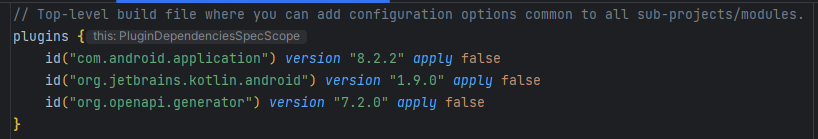
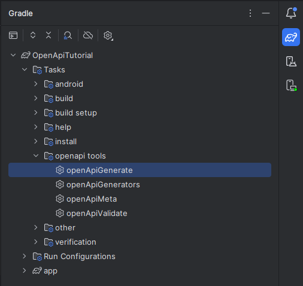
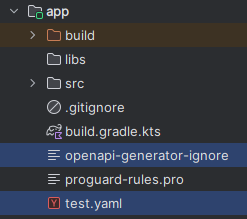
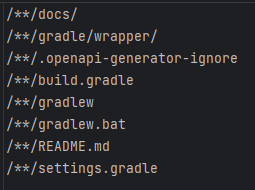
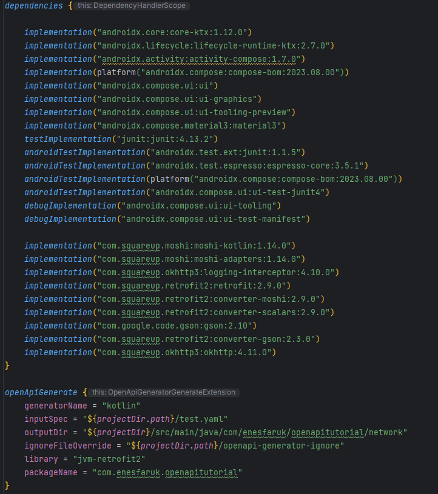
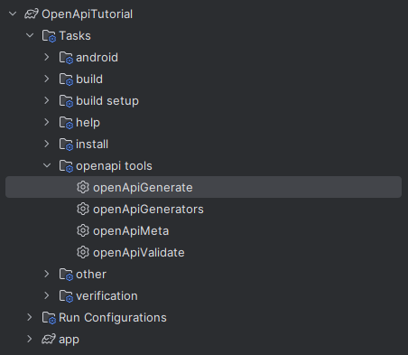
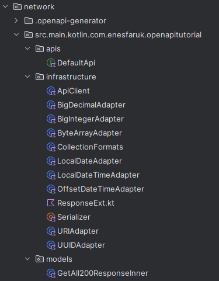
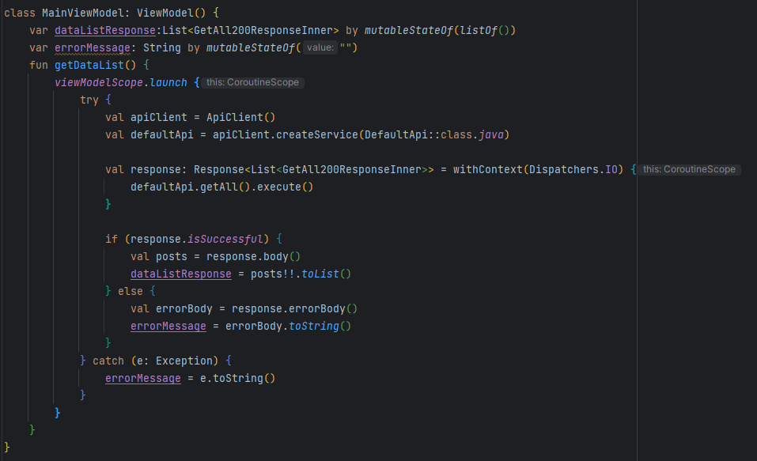
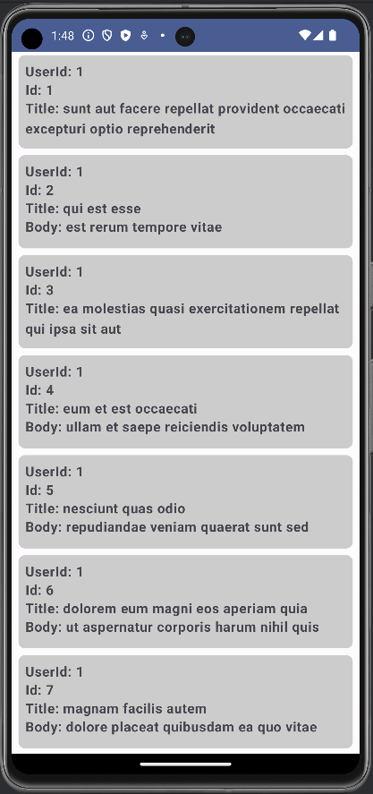

# OPENAPI GENERATOR - KOTLIN JETPACK COMPOSE

Bu proje her mobil uygulamada kullanılan API'lar için yazmamız gereken kodların otomatik oluşturulmasını göstermek için yazılmıştır. 
Uygulamada OpenApi Generator aracı ve Retrofit kütüphanesi kullanılmıştır. 
Tasarım için XML yerine Jetpack Compose kullanılmıştır.

OpenApi Generator, uygulamada api kullanımı için yazdığımız kodları otomatik olarak oluşturarak bize sunan bir araçtır. Detaylı bilgi için;
[OpenApi Generator](https://openapi-generator.tech/)
[OpenApi Generator Kotlin](https://openapi-generator.tech/docs/generators/kotlin)

OpenApi Generator aracını kullanmak için bize servisin .yaml dosyası gerekmektedir. OpenApi Generator bu .yaml dosyasını kullanarak gerekli dosyaları oluşturuyor.

## OpenAPI Generator Kurulumu

- Proje seviyesindeki build.gradle dosyasına `id("org.openapi.generator") version "7.2.0" apply false` ekleyin.



- Uygulama saviyesindeki build.gradle dosyasına `id("org.openapi.generator")` ekleyin.


- İki build.gradle dosyasına da pluginleri ekledikten sonra senkronize edin.

- Senkronizasyon işleminden sonra Gradle sekmesinde "Tasks/openapi tools" yoluna komutlar ekleniyor.



## OpenAPI Generator Konfigürasyonu

- "app" klasörünün içine kullanacağınız servislerinin .yaml dosyasını ekleyin.

- Sadece lazım olan dosyaların oluşturulması için "app" klasörü altına "openapi-generator-ignore" dosyasını oluşturun.



- "openapi-generator-ignore" dosyasının içine aşağıdaki kodları ekleyin;
```
/**/docs/
/**/gradle/wrapper/
/**/.openapi-generator-ignore
/**/build.gradle
/**/gradlew
/**/gradlew.bat
/**/README.md
/**/settings.gradle
```



- Manifest dosyasına internet izni için `<uses-permission android:name="android.permission.INTERNET"/>` satırını ekleyin.

- Uygulama seviyesindeki build.gradle dosyasının içine aşağıdaki kütüphaneleri ekleyin;
```
implementation("com.squareup.moshi:moshi-kotlin:1.14.0")
implementation("com.squareup.moshi:moshi-adapters:1.14.0")
implementation("com.squareup.okhttp3:logging-interceptor:4.10.0")
implementation("com.squareup.retrofit2:retrofit:2.9.0")
implementation("com.squareup.retrofit2:converter-moshi:2.9.0")
implementation("com.squareup.retrofit2:converter-scalars:2.9.0")
implementation("com.google.code.gson:gson:2.10")
implementation("com.squareup.retrofit2:converter-gson:2.3.0")
implementation("com.squareup.okhttp3:okhttp:4.11.0")
```

- Altına aşağıdaki OpenApi Generator konfigürasyon kodlarını ekleyin;
```
openApiGenerate {
    generatorName = "kotlin" //api dosyaları oluşturulurken kullanılacak dil
    inputSpec = "${projectDir.path}/test.yaml" //api dosyaları oluşturulurken referans alınacak yaml dosyasının dizini
    outputDir = "${projectDir}/src/main/java/com/enesfaruk/openapitutorial/network" //dosyaların oluşturulacağı dizin
    ignoreFileOverride = "${projectDir.path}/openapi-generator-ignore" //oluşturulmaması gereken dosyalar için ignore dosyasının dizini
    library = "jvm-retrofit2" //api dosyalarının oluşturulacağı kütüphane
    packageName = "com.enesfaruk.openapitutorial" // oluşturulacak dosyaların package name'i
}
```



## OpenApi Generator İle Tüm Api Dosyalarının oluşturulması

- Gradle sekmesinde oluşturulmuş "Tasks/openapi tools/openApiGenerate" komutunu çalıştırın, tüm gerekli dosyalar oluşturulsun.





## OpenApi Generator İle Oluşturulmuş Retrofit Kodlarının Kullanımı

- ViewModel dosyasına aşağıdaki kodu ekleyerek otomatik oluşturulmuş api kodlarını kullanın.



## Sonuç

- Interface'i, modelleri, client'ı otomatik olarak openApi generator ile oluşturulmuş uygulamanın çalıştırıldığındaki ekran görüntüsü;


